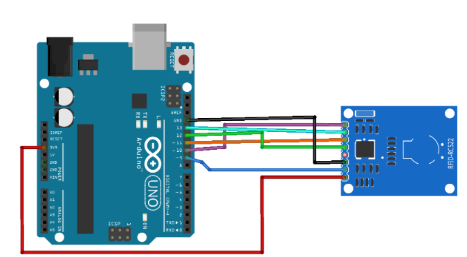

# NFC Communication

## Overview

This projet group few test code to understand how works NFC communication with utilisation like Bambu spool; NFC card or TAG. For this projet, the DFR0231-H and the RFID-RC522 boards were used.
The DRF0231-H board have been used to add some message and also read the information of the different NFC TAG. For the RFID-RC522, it was only used to read the information of the NFC TAG.
To use the two NFC card, Arduino UNO R4 WIFI have been used during all the test.

## Connection with the Arduino UNO board

### 1. DFR0231-H

This board can be used with to communication solution : I2C and UART. For all the solution, the communication used is the **I2C** communication.
For the connection with the Arduino UNO board need to use the following table :

| DRF0231-H Pin| Arduino UNO Pin |
|--------------------|--------|
|**D/T**              | A4     |
|**C/R**              | A5     |
|**GND**              | GND     |
|**VCC**              | 5V     |

### 2. RFID-RC522

For the connection with the Arduino UNO board need to use the following table and the following picture :

| RFID-RC522 Pin| Arduino UNO Pin |
|--------------------|--------|
|**SDA**              | ~10     |
|**SCK**              | 13     |
|**MOSI**              | ~11     |
|**MISO**              | 12     |
|**IRQ**              | No connected     |
|**GND**              | GND     |
|**RST**              | ~9     |
|**3V3**              | 3V3     |


<p align="center">
  
  <br>
  RC522 connection with Arduino UNO
</p>

## What does the code do ?

### A-DRFOBOT

For this code, the DRF0231-H have been use during the test.
The code **DFROBOT** allow to know information about the Bambu Lab spool. The following information can be obtained :

```
==============================
       SPOOL DETECTED
==============================
Material variant: A00-K0.. | Material ID: GFA00...
Filament type: PLA.............
Detailed type: PLA Basic.......
Color (RGBA): 000000FF
Spool weight: 1000 g
Filament diameter: 1.75 mm
Drying: 55 C for 8h
Bed temperature: 0 C
Nozzle temperature: 190 - 230 C
Tray UID: 4A 14 D8 7F 51 F0 40 54 9E 4A DB BD 7D 56 8C C3 
Spool width: 28.75 mm
Production date: 2025_04_24_08_15
Filament length (approx): 330 m
==============================
```

To have the information, need to place on the NFC card the Bambu spool few secondes. 
All the information come from the following link : https://github.com/Bambu-Research-Group/RFID-Tag-Guide/blob/main/BambuLabRfid.md#block-5 . All the spool information can't be print in the Arduino code because they don't have a lot of information (for the moment).
### B-WRITE

For this code, the DFR0231-H have been use during the test.
The code **WRITE** allow to add some information into a NFC card or TAG. When you place the TAG on the NFC card, you can see the different BLOCK with their HEXA message. After, we can enter the number of the BLOCK you want know the message.
In the code we can change the message you want to have in one BLOCK (16 characters max for one BLOCK). 

```cpp
uint8_t dataWrite[BLOCK_SIZE] = "CHANGE MESSAGE"; 
```

You can also edit each BLOCK, just need to edit the printblock() argument with the number of the BLOCK you want

```cpp
printBlock(2);
```
### C-RC522

For this code need to use the RFID-RC522 board.
The code **RC522** allow to read information of the NFC card or TAG. When a card or TAG is placed on the NFC board, all the information of the different BLOCK can be saw in HEXA. After we can enter a number to see the translate message in text.

```
Enter block number to convert to text :

Reading saved block 2
HEX : 48 45 4C 4C 4F 20 4E 46 43 20 54 41 47 00 00 00 
TEXT: HELLO NFC TAG...
```

### D-ACCESS_NFC

For this code need to use the RFID-RC522 board.
The code **ACCESS_NFC** allow to accept/deny access of different card. To accept the access of one card, need to add the UID of the card on the following part : 

```cpp
// List of authorized UIDs
byte authorizedUIDs[MAX_AUTHORIZED_TAGS][MAX_UID_SIZE] = {

  // TAG 1
  {0xF7, 0x66, 0xA9, 0x5F},

  // TAG 2
  // Example:
  {0x47, 0xB8, 0x44, 0x62},

};
```
To have the UID of on card, you can use the **UID_Information** code to recup the UID of one card.
You need also to add the size of the UID, in the following part :

```cpp
// UID size of each authorized TAG
byte authorizedUIDSizes[MAX_AUTHORIZED_TAGS] = {

  // TAG 1
  4,

  // TAG 2
  4,

};
```

### E-UID_Inforamtion

For this code need to use the RFID-RC522 board.
The code **UID_Information** allow to have information about the card, the TAG you to use. The information you can have are the following : **UID**, **SAK** and **Card type**.
